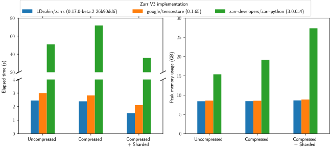
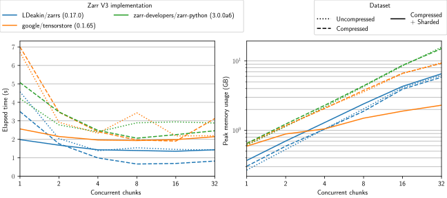
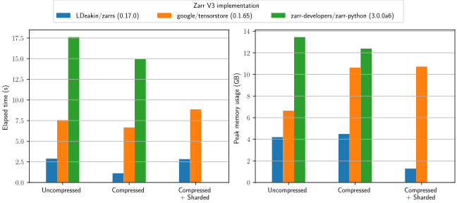

# Benchmarks

## Benchmark Data
Benchmark data is generated with `scripts/generate_benchmark_array.py` as follows
```bash
./scripts/generate_benchmark_array.py data/benchmark.zarr
./scripts/generate_benchmark_array.py --compress data/benchmark_compress.zarr
./scripts/generate_benchmark_array.py --compress --shard data/benchmark_compress_shard.zarr
```
- Data type: `uint16`
- Array shape: $1024\times2048\times2048$
- Chunk/shard shape:
  - Default: $512^3$
  - `--shard`: $512^3$ with $32^3$ inner chunk shape
- Bytes to bytes codec for chunks/inner chunks:
  - Default: none
  - `--compress`: `blosclz` level 9 with bitshuffling
- Size on disk
  - `data/benchmark.zarr`: 8.0G
  - `data/benchmark_compress.zarr`: 377M
  - `data/benchmark_compress_shard.zarr`: 1.1G

## Benchmark System
- AMD Ryzen 5900X
- 64GB DDR4 3600MHz (16-19-19-39)
- 2TB Samsung 990 Pro
- Ubuntu 22.04 (in Windows 11 WSL2, swap disabled, 32GB available memory)

## Implementations Benchmarked
- [`LDeakin/zarrs`](https://github.com/LDeakin/zarrs) v0.17.0 (Rust 1.81.0) via [`LDeakin/zarrs_tools`](https://github.com/LDeakin/zarrs_tools) 0.6.0 (4beba5f)
  - Benchmark executable (read): [zarrs_benchmark_read_sync](https://github.com/LDeakin/zarrs_tools/blob/main/src/bin/zarrs_benchmark_read_sync.rs)
  - Benchmark executable (round trip): [zarrs_benchmark_read_sync](https://github.com/LDeakin/zarrs_tools/blob/main/src/bin/zarrs_reencode.rs)
- [`google/tensorstore`](https://github.com/google/tensorstore) v0.1.65 (Python 3.12.5)
  - Benchmark script (read): <https://github.com/LDeakin/zarrs_tools/blob/main/scripts/tensorstore_python_benchmark_read_async.py>
  - Benchmark script (round trip): <https://github.com/LDeakin/zarrs_tools/blob/main/scripts/tensorstore_python_benchmark_roundtrip.py>
- [`zarr-developers/zarr-python`](https://github.com/zarr-developers/zarr-python) 3.0.0a6 (Python 3.12.5)
  - Benchmark script (read): <https://github.com/LDeakin/zarrs_tools/blob/main/scripts/zarr_python_benchmark_read_async.py>
  - Benchmark script (roundtrip): <https://github.com/LDeakin/zarrs_tools/blob/main/scripts/zarr_python_benchmark_roundtrip.py>

> [!CAUTION]
> Python benchmarks (`tensorstore` and `zarr-python`) are subject to the overheads of Python and may not be using an optimal API/parameters.

## Read Benchmarks

### Entire Array
This benchmark measures the minimum time and and peak memory usage to read an entire dataset into memory.
 - These are best of 3 measurements
 - The disk cache is cleared between each measurement

```bash
python3 ./scripts/run_benchmark_read_all.py
```



 > [!NOTE]
 > `zarr-python` is excluded with sharding. It takes too long.

[Table of raw measurements (benchmarks_read_all.md)](./benchmark_read_all.md)

### Chunk-By-Chunk

This benchmark measures the the minimum time and peak memory usage to read a dataset chunk-by-chunk into memory.
 - These are best of 1 measurements
 - The disk cache is cleared between each measurement

```bash
python3 ./scripts/run_benchmark_read_chunks.py
```



 > [!NOTE]
 > `zarr-python` is excluded with sharding. It takes too long.

[Table of raw measurements (benchmarks_read_chunks.md)](./benchmark_read_chunks.md)

## Round Trip Benchmarks

This benchmark measures time and peak memory usage to "round trip" a dataset (potentially chunk-by-chunk).
 - These are best of 3 measurements
 - The disk cache is cleared between each measurement

```bash
python3 ./scripts/run_benchmark_roundtrip.py
```



 > [!NOTE]
 > `zarr-python` is excluded with sharding. It takes too long.

[Table of raw measurements (benchmarks_roundtrip.md)](./benchmark_roundtrip.md)
